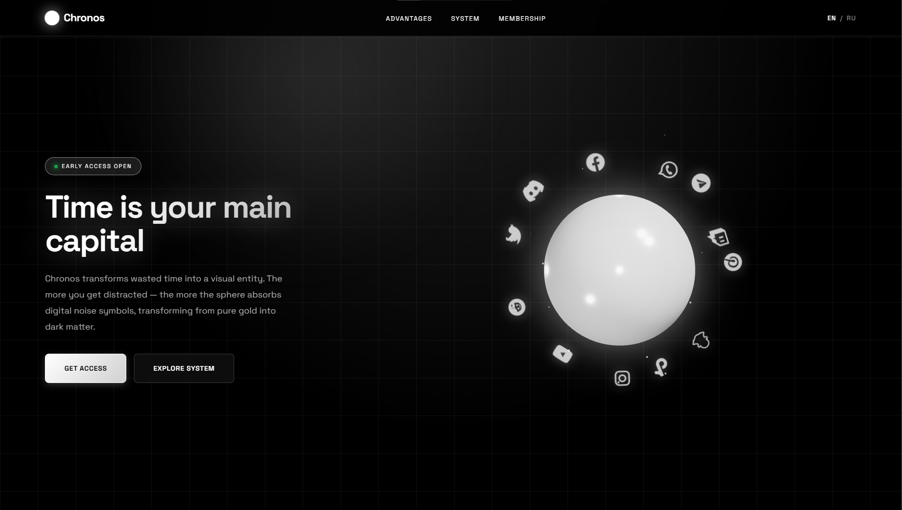

# ⏳ Chronos

**3D-визуализация прокрастинации** — смотрите, как ваше время превращается в чёрную массу.

---

## 🔥 О проекте

Chronos — это минималистичное веб-приложение, которое визуализирует потерянное время в реальном времени.

- 🎨 **Белая сфера** становится **чёрной** по мере того, как вы отвлекаетесь
- 🌐 **Иконки соцсетей** поглощаются сферой в прямом эфире
- ⚡ **Плавные 60 FPS** анимации на Three.js
- 🌍 **Двуязычный интерфейс** (EN / RU)
- 📱 **Полностью адаптивный** дизайн

## 🌟 Roadmap

- [ ] Расширение для браузера (Chrome/Firefox)
- [ ] Трекинг реального времени в приложениях
- [ ] Статистика и отчёты
- [ ] Мобильное приложение

## 👤 Автор

Создано с 💜 для борьбы с прокрастинацией.

**[Ваш LinkedIn]([https://linkedin.com/in/ваш-профиль](https://www.linkedin.com/in/%D0%BC%D1%83%D1%81%D0%BE-%D1%88%D0%BE%D0%BA%D0%B8%D1%80%D0%BE%D0%B2-1907483bb/?locale=en-US))** 

---

  <strong>⏳ Время — ваш главный капитал. Не теряйте его.</strong>

